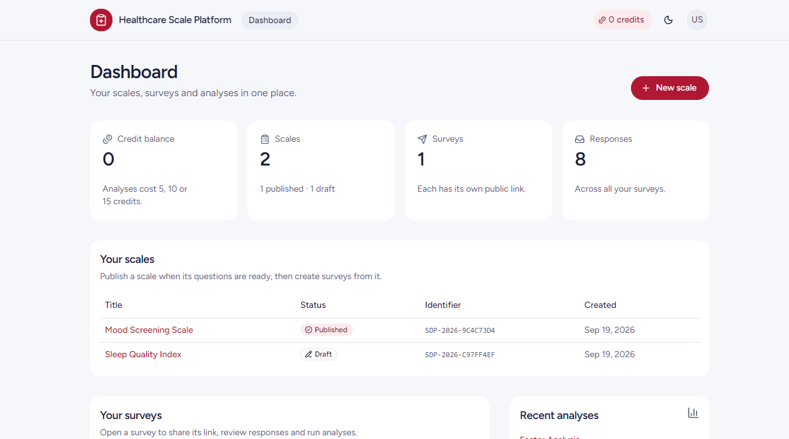
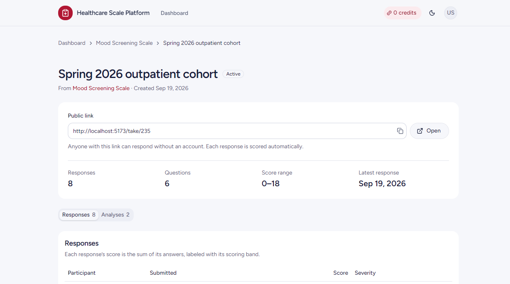
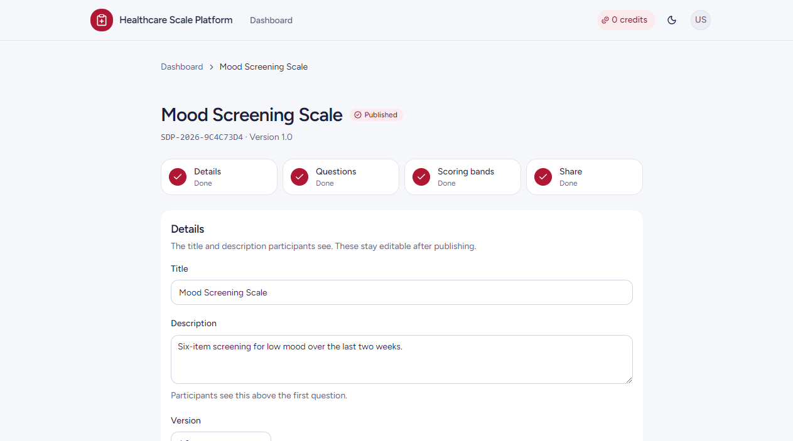
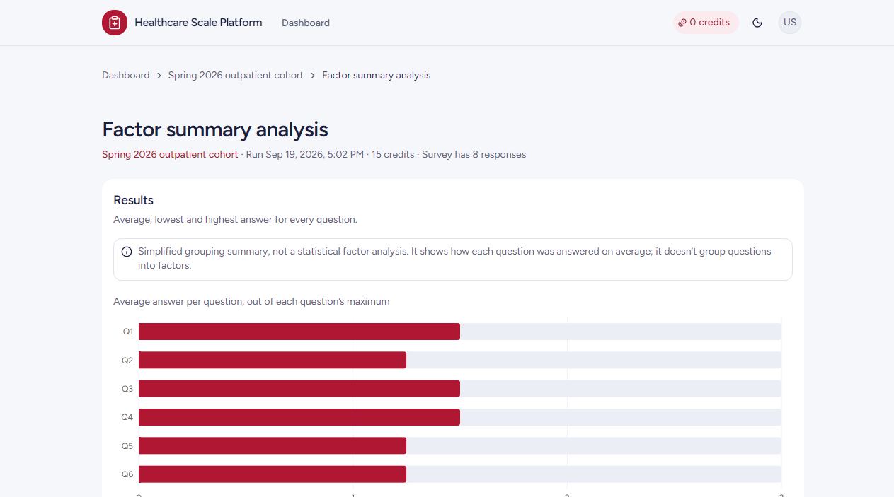
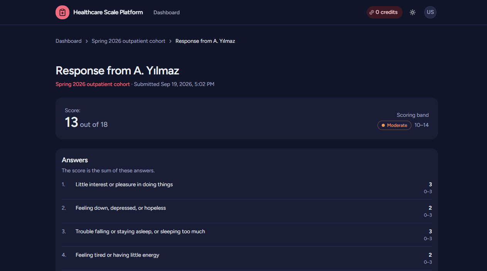
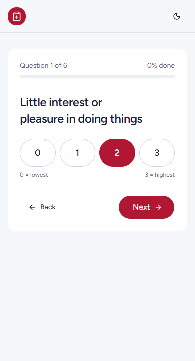

# Healthcare Scale Platform

A full-stack platform for building and running healthcare assessment scales. Researchers design a scale (questions + scoring bands), publish it, collect responses through a public survey link, and run credit-gated statistical analyses on the results.

The scale is data, not code. Beck Depression, PHQ-9, GAD-7 or any other instrument is expressed as a `Scale` record with questions and scoring bands, so no instrument-specific logic is hardcoded.

- **Backend:** Rails 8 API-only, PostgreSQL, JWT auth, Pundit authorization, Jbuilder views
- **Frontend:** React 19 + Vite + React Router, Tailwind CSS v4 + shadcn/ui, Recharts (`frontend/`)
- **Testing:** Minitest request tests, Cypress + Cucumber (BDD) E2E, Postman/Newman
- **Architecture notes:** [`ARCHITECTURE.md`](ARCHITECTURE.md)


## Screenshots

| Dashboard | Survey: share link and responses |
|---|---|
|  |  |
| **Scale builder** | **Factor summary report** |
|  |  |
| **Response (dark mode)** | **Participant view (mobile)** |
|  |  |

## Features

- Register and log in (JWT bearer tokens)
- Scale builder: create a scale, add and edit questions, set scoring bands, publish it. Publishing locks questions and bands.
- Scoring bands per scale (e.g. `Minimal 0-4`, `Mild 5-9`) resolved into a severity label for each response
- Public survey link, no account needed: one question per screen, a "check your answers" step, progress kept across a refresh
- Owner-only responses table and response view (score out of the maximum, band, every answer)
- Analyses (descriptive, correlation, factor summary) that cost credits and return `422` when the balance is too low, with readable reports and a chart
- Light and dark theme, keyboard accessible, Lighthouse accessibility score of 100 on the main pages (light and dark, mobile and desktop)

## Quick Start

### Prerequisites

- Ruby 3.4 and Bundler
- PostgreSQL
- Node.js (frontend and Cypress)

### 1. Backend (Rails API, port 3000)

```bash
bundle install
cp .env.example .env        # fill in DB_HOST, DB_PORT, DB_USERNAME, DB_PASSWORD
bin/rails db:setup          # create, load schema, seed
bin/rails server
```

`.env` is gitignored and loaded automatically in development and test.

The seed creates two users, both with password `password123`:

| Email | Role | Credits |
|---|---|---|
| `researcher@example.com` | researcher | 100 |
| `student@example.com` | student | 50 |

### 2. Frontend (React, port 5173)

```bash
cd frontend
cp .env.example .env        # VITE_API_BASE_URL=http://localhost:3000/api/v1
npm install
npm run dev
```

Open `http://localhost:5173`. More on the frontend in [`frontend/README.md`](frontend/README.md). CORS on the API is configured for that origin (`config/initializers/cors.rb`).

## Using the App

1. Register or log in.
2. **Dashboard:** your credit balance, scales, surveys and recent analyses.
3. **Scale builder:** create a scale, add questions and scoring bands, publish.
4. Create a survey from the published scale and share its `/take/:id` link.
5. A participant answers one question per screen, reviews the answers and submits.
6. As the owner, open the survey's responses and click one for its score and severity band.
7. On the survey's Analyses tab, run an analysis and open its report.

## API (v1)

Everything except login, registration, `GET /surveys/:id` and response submission (the public survey flow) requires `Authorization: Bearer <token>`.

| Resource | Endpoints |
|---|---|
| Session | `POST /api/v1/session` (login, returns a JWT) |
| Users | `GET /users`, `GET /users/:id`, `POST /users` (register), `PATCH /users/:id` (own profile only) |
| Scales | `GET /scales`, `GET /scales/:id` (embeds questions), `POST`, `PATCH`, `DELETE`, `PATCH /scales/:id/publish` |
| Questions | `POST /scales/:scale_id/questions`, `PATCH` and `DELETE /scales/:scale_id/questions/:id` |
| Surveys | `GET /surveys`, `GET /surveys/:id`, `POST`, `PATCH`, `DELETE` |
| Responses | `POST /responses` (public), `GET /responses`, `GET /responses/:id`, `GET /responses/:id/export` |
| Analyses | `GET /analyses`, `GET /analyses/:id`, `POST /analyses`, `GET /analyses/:id/report` |

- `index` actions take `page` and `per` params. `GET /scales`, `GET /surveys` and `GET /analyses` return only the signed-in user's own records.
- `DELETE` returns `422` instead of cascading when a scale still has surveys or a survey still has responses.
- Responses cannot be updated or deleted once submitted.
- Scoring bands are set with `PATCH /scales/:id` (`{"scale":{"scoring_bands":[{"label":"Low","min":0,"max":4}]}}`). Bands need a label and whole-number `min <= max`, and can't overlap.
- Publishing needs at least one question, and locks the scale: adding, editing or deleting its questions, or changing its scoring bands, returns `422`. Title, description and version stay editable.
- Request bodies are wrapped by resource. Sample payloads are in the `documentation/` folder (`login.json`, `scale.json`, ...).

### Example

```bash
# 1. Log in
curl -X POST http://localhost:3000/api/v1/session \
  -H "Content-Type: application/json" -H "Accept: application/json" \
  -d '{"email":"researcher@example.com","password":"password123"}'

# 2. Submit a response (nested answers, validated against each question's range)
curl -X POST http://localhost:3000/api/v1/responses \
  -H "Content-Type: application/json" -H "Accept: application/json" \
  -d '{"response":{"survey_id":1,"participant_name":"Tester","answers_attributes":[{"question_id":1,"value":3},{"question_id":2,"value":4}]}}'

# 3. Run an analysis (token from step 1)
curl -X POST http://localhost:3000/api/v1/analyses \
  -H "Content-Type: application/json" -H "Accept: application/json" \
  -H "Authorization: Bearer $TOKEN" \
  -d '{"analysis":{"survey_id":1,"analysis_type":"descriptive"}}'
```

## Data Model

```
User ──< Scale ──< Question
 │         │           │
 │         └──< Survey │
 │               │     │
 └──< Survey ──< Response ──< Answer >── Question
 └──< Analysis >── Survey
```

| Model | Notes |
|---|---|
| `User` | `role` (admin/researcher/student), `credits`, `has_secure_password` |
| `Scale` | `status`, `identifier`, `scoring_bands` (jsonb) |
| `Question` | `text`, `position` (unique per scale), `min_value`, `max_value` |
| `Survey` | A distribution of a scale, owns its responses |
| `Response` | One participant's submission; `calculate_score` and `severity_band` |
| `Answer` | `value` within the question's range, one per response and question |
| `Analysis` | `analysis_type`, `credits_used`, `results` (jsonb), optional `question_a_id` / `question_b_id` |

## Credit-Gated Analyses

| Type | Cost | Output |
|---|---|---|
| `descriptive` | 5 | mean, median, standard deviation, min, max, n of response scores |
| `correlation` | 10 | Pearson correlation between two questions (needs `question_a_id` and `question_b_id`) |
| `factor` | 15 | Per-question average, min and max. A lightweight summary, not a real factor analysis, and its output says so. |

## Testing

```bash
bin/rails test                      # Minitest: request tests for every controller action
bin/rubocop                         # style
bin/brakeman                        # static security scan
```

E2E (Cypress + Cucumber) runs against the real app, so start the Rails server and the frontend first. Start Vite with `npm run dev -- --host` so it also listens on `127.0.0.1`, which Cypress uses:

```bash
npm install                         # repo root
npm run cy:open                     # interactive
npm run cy:run                      # headless
```

The Postman collection (`postman_collection.json`) opens with an Auth folder (register, login) and carries the bearer token through the rest. Run it headless with Newman:

```bash
newman run postman_collection.json -r html
```

CI (`.github/workflows/ci.yml`) runs Brakeman, RuboCop and the Minitest suite.

## Project Structure

```
app/
├── controllers/api/v1/   # versioned API controllers
├── models/               # ActiveRecord models
├── policies/             # Pundit authorization
├── services/analyses/    # descriptive, correlation, factor
├── views/api/v1/         # Jbuilder serializers
└── lib/json_web_token.rb
frontend/src/
├── pages/                # one component per route, lazy-loaded
├── components/           # app components (ui/ holds the shadcn/ui primitives)
├── api/client.js         # fetch wrapper, JWT header, readable error messages
├── auth/                 # AuthContext, RequireAuth
└── lib/                  # formatting, severity colors, analysis helpers
docs/screenshots/         # README images
cypress/                  # Cucumber features + step definitions
test/                     # Minitest request tests and fixtures
```

## Deployment

Kamal (`config/deploy.yml`) and a `Dockerfile` are included from the original scaffold but the deployment has not been set up or tested for this rebuild.

## License

Part of a software implementation and testing course project.
